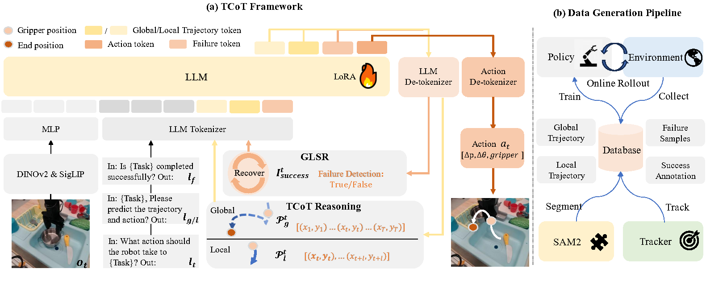

# TCoT: Trajectory Chain-of-thoughts for Robotic Manipulation with Failure Recovery in Vision-Language-Action Model

<!-- []()
[]()
[](https://www.python.org)
[](LICENSE)
[]() -->


<!-- [Xiang Li, Tsinghua University](https://github.com/Serenos)
<hr style="border: 2px solid gray;"></hr> -->

 we introduce TCoT, a unified VLA framework that enhances this direct mapping with trajectory planning as well as failure detection and recovery.
TCoT leverages hierarchy trajectories as a precise and compact representation of CoT reasoning for manipulation: global planning provides a high-level, goal-oriented trajectory to guide the robot toward its task objective, while local planning focuses on real-time adjustments to address dynamic changes.
Moreover, we designed the Global-Local Switching Recovery algorithm that detects and effectively recovers from failures. 

Our codebase is built on top of [OpenVLA](https://github.com/openvla/openvla) and [ECoT](). We refer to it for the detailed
documentation of the code and dependencies.



## Quickstart
The global and local trajectory genreate by TCoT on libero looks like this:

 

We provide a [Colab notebook]() containing code for loading up our TCoT policy and using it to generate reasoning and actions in response to an observation. Loading the model for inference is easy:
```python
from transformers import AutoModelForVision2Seq, AutoProcessor

device = "cuda"
path_to_hf = "Embodied-CoT/ecot-openvla-7b-bridge"
processor = AutoProcessor.from_pretrained(path_to_hf, trust_remote_code=True)
vla = AutoModelForVision2Seq.from_pretrained(path_to_hf, torch_dtype=torch.bfloat16).to(device)

observation = <ROBOT IMAGE OBSERVATION HERE>
instruction = <YOUR INSTRUCTION HERE>
prompt = "A chat between a curious user and an artificial intelligence assistant. " + \
    "The assistant gives helpful, detailed, and polite answers to the user's questions. " + \
    f"USER: What action should the robot take to {instruction.lower()}? ASSISTANT: TASK:"

inputs = processor(prompt, image).to(device, dtype=torch.bfloat16)
action, generated_ids = vla.predict_action(**inputs, unnorm_key="bridge_orig", max_new_tokens=1024)
generated_text = processor.batch_decode(generated_ids)[0]
```
The standard model in `torch.bfloat16` requires 16 GB of GPU memory, but using [bitsandbytes](https://huggingface.co/docs/bitsandbytes/main/en/index) and 4-bit quantization lowers memory usage to around 5 GB. See the Colab for more details.

## Training and Evaluation

To train the models, from scratch use the following command:

```bash
bash ./vla-scripts/finetune_tcot.sh
```

To evaluate the model on the libero,

```bash
python experiments/robot/libero/run_libero_eval_tcot_globallocal.py + args
```

To evaluate the model on real robot arm (AIRBOT),

```bash
client:
  python experiments/robot/airbot/airbot_client_aug_tcot.py + args
server:
  pyton experiments/robot/airbot/deploy_tcot.py + args
```

## Pretrained models

We release two TCoT models trained as part of our work, and the dataset of trajectory-based reasonings, available [on our
HuggingFace page]():
- [`libero_spatial_trajectory`](scripts\generate_trajectory\trajectory_data\full_trajectory_v3.1_libero_spatial.json): The trajectory-based reasoning dataset for libero-spatial dataset.
- [`libero_goal_trajectory`](scripts\generate_trajectory\trajectory_data\full_trajectory_v3.1_libero_goal.json): The trajectory-based reasoning dataset for libero-goal dataset.
- [`libero_object_trajectory`](C:\Users\lixiang\Documents\GitHub\TCoT\scripts\generate_trajectory\trajectory_data\full_trajectory_v3.1_libero_object.json): The trajectory-based reasoning dataset for libero-object dataset.
- [`libero_10_trajectory`](scripts\generate_trajectory\trajectory_data\full_trajectory_v3.1_liber_o10.json): The trajectory-based reasoning dataset for libero-10 dataset.


**Explicit Notes on Model Licensing & Commercial Use**: While all code in this repository is released under an MIT
License, our pretrained models may inherit restrictions from the underlying base models we use. Specifically, both the
above models are derived from Llama-2, and as such are subject to the
[Llama Community License](https://ai.meta.com/llama/license/).

---

## Installation

See the original [OpenVLA](https://github.com/openvla/openvla) repository for detailed installation instructions.

## Repository Structure

High-level overview of repository/project file-tree:

+ `prismatic` - Package source; provides core utilities for model loading, training, data preprocessing, etc.
+ `experiments` - Code for evaluating the policies on a WidowX robot.
+ `vla-scripts/` - Core scripts for training, fine-tuning, and deploying VLAs.
+ `LICENSE` - All code is made available under the MIT License; happy hacking!
+ `Makefile` - Top-level Makefile (by default, supports linting - checking & auto-fix); extend as needed.
+ `pyproject.toml` - Full project configuration details (including dependencies), as well as tool configurations.
+ `README.md` - You are here!

---

<!-- #### Citation

If you find our code or models useful in your work, please cite [our paper]():

```bibtex
@article{lixiang25-tcot,
    title={TCoT: Trajectory Chain-of-thoughts for Robotic Manipulation with Failure Recovery in Vision-Language-Action Model},
    author={Xiang Li, Ya-Li Li, Yuan Wang, Huaqiang Wang, Shengjin Wang},
    journal={arXiv preprint},
    year={2025}
}
``` -->
